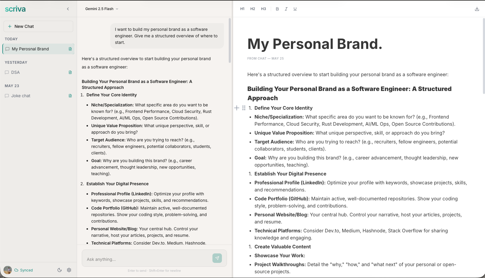
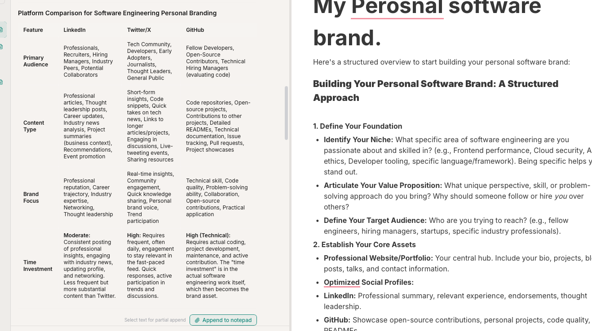
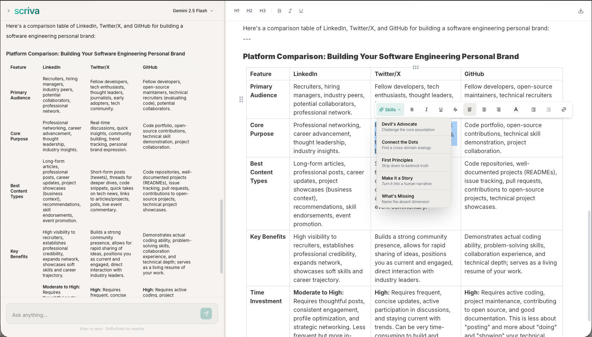
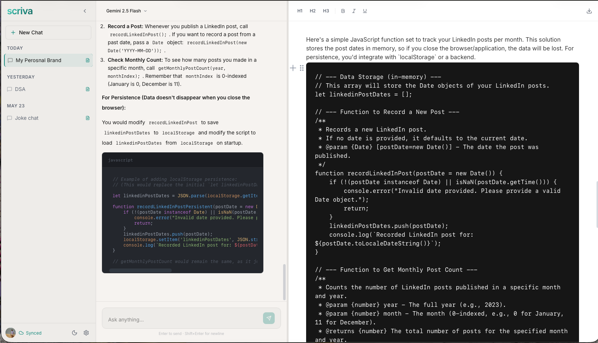
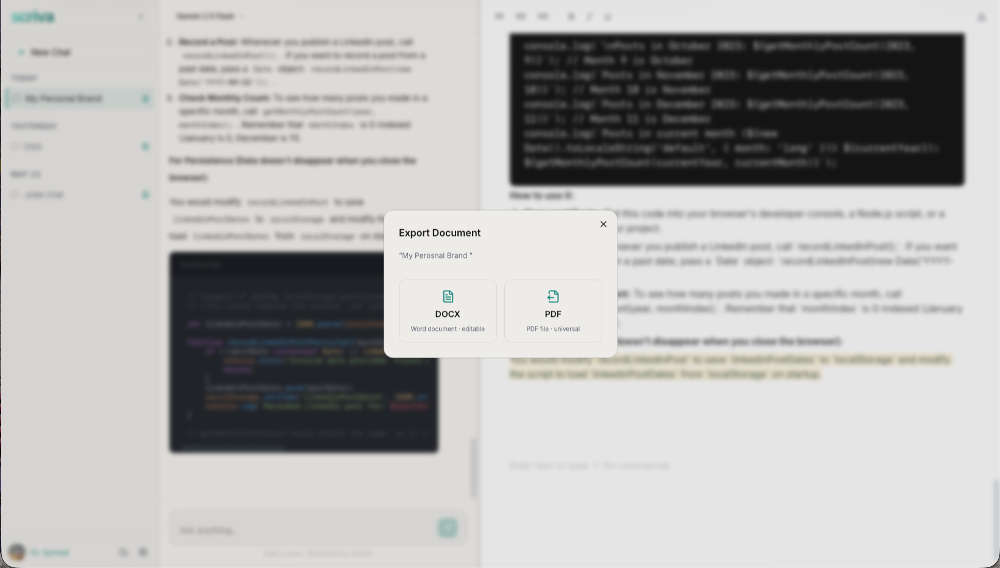
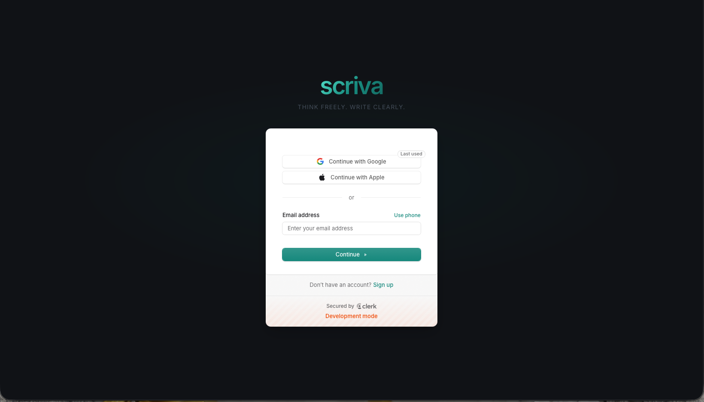
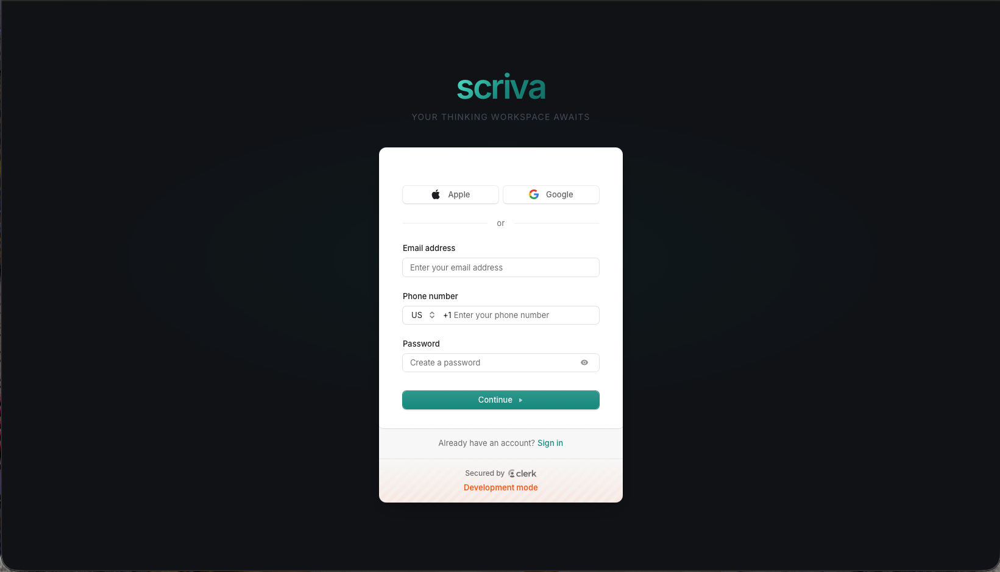

# Scriva

> **A thinking workspace where your best ideas don't get lost in a chat thread.**

Scriva is a three-panel productivity app that fuses an AI chat assistant with a rich-text notepad — purpose-built for people who think out loud, then need somewhere to put the result. Chat on the left, write on the right, and let AI bridge the gap between raw thought and finished prose.


---

## Screenshots

### Workspace Overview


_Three-panel layout — Sidebar · Chat · Notepad_

### AI Chat + Append to Notepad


_Append any AI response (including code blocks and tables) directly to the notepad_

### Scriva Skills


_Select text in the notepad, pick a thinking skill, and get a context-enriched AI response_

### Rich BlockNote Editor


_Full block editor — headings, lists, code, tables, checklists, drag-and-drop reordering_

### Export Options


_Export the current document as PDF, DOCX, or Markdown_

### Login


\_LoginPage supported ny clerk

### SignUp


\_Sign up page

---

## Features

### Three-Panel Workspace

A resizable sidebar, AI chat panel, and rich-text notepad all live in one view. Drag the dividers to tune the layout to your workflow — state persists across the session.

### Scriva Skills

Select any text in the notepad and apply a thinking skill to it:

- **Devil's Advocate** — surfaces the strongest counterargument
- **Connect the Dots** — finds non-obvious links between ideas
- **First Principles** — strips assumptions and rebuilds from the ground up
- **Make it a Story** — transforms dry notes into compelling narrative
- **What's Missing** — identifies gaps, blind spots, and overlooked questions

Each skill fires a context-enriched prompt to the AI and renders a styled skill bubble in chat — so you always know what triggered what.

### Bidirectional Notepad ↔ Chat Loop

AI responses can be appended directly to the notepad with one click. The notepad is the source of truth; the chat is the thinking tool. Nothing gets lost.

### Rich BlockNote Editor

Full block-based editing with headings, lists, checklists, quotes, dividers, code blocks (with syntax highlighting), tables, drag-and-drop reordering, and text/background colors — all powered by BlockNote 0.51.

### Export Anywhere

Export the current document as **PDF**, **DOCX**, or **Markdown** without leaving the app.

### Auth + Cloud Sync _(in progress)_

Clerk authentication with Supabase PostgreSQL backend. Sessions, documents, and chat history persist per user across devices.

---

## Getting Started

### Prerequisites

- Node.js 20+
- A [Clerk](https://clerk.com) account (for auth)
- A [Supabase](https://supabase.com) project (for the database)
- An OpenAI or Google Gemini API key

### 1. Clone and install

```bash
git clone https://github.com/your-username/scriva.git
cd scriva
npm install
```

### 2. Configure environment variables

```bash
cp .env.example .env.local
```

Fill in `.env.local`:

```env
# Clerk
NEXT_PUBLIC_CLERK_PUBLISHABLE_KEY=pk_...
CLERK_SECRET_KEY=sk_...
NEXT_PUBLIC_CLERK_SIGN_IN_URL=/sign-in
NEXT_PUBLIC_CLERK_SIGN_UP_URL=/sign-up

# Supabase / PostgreSQL
DATABASE_URL=postgresql://...

# AI — pick one or both
OPENAI_API_KEY=sk-...
GOOGLE_GENERATIVE_AI_API_KEY=AIza...
```

### 3. Set up the database

```bash
npx prisma generate
npx prisma db push
```

### 4. Run the dev server

```bash
npm run dev
```

Open [http://localhost:3000](http://localhost:3000). You'll be redirected to `/workspace` automatically.

---

## Architecture

```
src/
├── app/
│   ├── api/
│   │   ├── chat/          # Vercel AI SDK streaming route — model routing, skill injection
│   │   └── webhooks/      # Clerk webhook → upsert User in Supabase
│   ├── sign-in/           # Clerk hosted UI wrappers
│   ├── sign-up/
│   ├── workspace/         # Main app shell (protected route)
│   └── layout.tsx         # Inter + Lora fonts, ClerkProvider, dark class
│
├── components/
│   ├── layout/
│   │   ├── WorkspaceLayout.tsx    # Three-panel orchestrator (60fps resize via refs)
│   │   ├── Sidebar.tsx            # Session CRUD, wired to Zustand
│   │   ├── ChatPanel.tsx          # AI chat, SkillMessageBubble, append-to-notepad
│   │   ├── NotepadPanel.tsx       # BlockNote host + toolbar
│   │   └── ResizeHandle.tsx       # 4px drag divider
│   └── notepad/
│       ├── NotepadEditor.tsx      # BlockNote editor, pendingAppend watcher
│       └── SelectionToolbar.tsx   # "Scriva Skills" dropdown on text selection
│
├── hooks/
│   ├── useSession.ts      # Clerk session helpers
│   └── useCloudSync.ts    # Zustand → Supabase sync layer
│
├── lib/
│   ├── blocknote-schema.tsx   # Custom "annotated" block type (contextLabel + appendedAt)
│   ├── markdown-to-blocks.ts  # Markdown paste/import pipeline
│   └── skills.ts              # SkillId, SKILL_PROMPTS, SKILL_NAMES, parseSkillMessage
│
└── store/
    └── workspace.ts       # Zustand store: sessions, documents, pendingAppend, pendingChatPrompt
```

### Key Design Decisions

**Local-first state with cloud sync** — Zustand is the single source of truth in the client. Supabase writes are async and non-blocking, so the UI is always instant.

**Skill system via system injection** — Each skill appends a `systemInjection` string to the base system prompt for that turn only. No persistent context pollution between skill calls and regular chat.

**Custom BlockNote block** — The `annotated` block type stores `contextLabel` and `appendedAt` metadata on blocks appended from AI. Export strips these before generating the output document.

**60fps panel resizing** — `WorkspaceLayout` drives all resize logic through `useRef` + `requestAnimationFrame`, bypassing React state updates entirely during drag.

**Per-model routing at the API layer** — `/api/chat` reads a `model` field from the request body and switches between `openai` and `google` providers at runtime without any client changes.

### Data Model

```
User (Clerk ID) ──< Session >──< ChatMessage
                        │
                        └──── Document (BlockNote JSON blocks)
```

Each `Session` owns exactly one `Document`. Chat history and notepad content are always co-located and deleted together.

---

## Tech Stack

| Layer     | Technology                                  |
| --------- | ------------------------------------------- |
| Framework | Next.js 15 (App Router, Turbopack)          |
| Language  | TypeScript 5                                |
| Styling   | Tailwind CSS v4 + shadcn/ui                 |
| Editor    | BlockNote 0.51                              |
| AI        | Vercel AI SDK 4 (OpenAI / Google Gemini)    |
| State     | Zustand 5                                   |
| Auth      | Clerk                                       |
| Database  | Supabase (PostgreSQL) + Prisma 7            |
| Export    | @blocknote/xl-pdf-exporter, docx, react-pdf |
